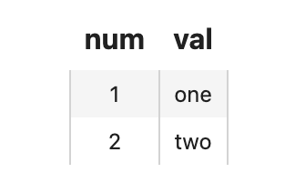
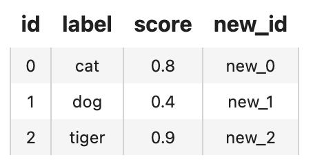
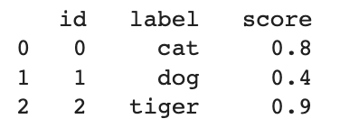
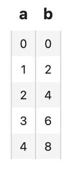
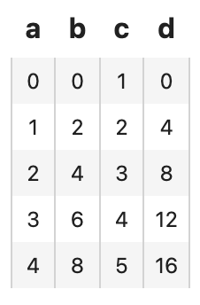

summary: Getting Started with Towhee - Introduction to DataCollection
id: getting-started-with-towhee-introduction-to-datacollection
categories: Getting Started
tags: DataCollection
status: Published
authors: Shiyu
Feedback Link: https://github.com/towhee-io/towhee

---

# Getting Started with Towhee - Introduction to DataCollection

## What is DataCollection

duration: 0.5

DataCollection(DC) is a pythonic computation framework for unstructured data in machine learning and data science. It provides a [method-chaining style API](https://towhee.readthedocs.io/en/main/index.html) that makes it easier for a data scientist or researcher to assemble a data processing pipeline.

- Pythonic Method-Chaining Style API: Designed to behave as a python list or iterator, DataCollection is easy to understand for python users and is compatible with most popular data science toolkits. Function/Operator invocations can be chained one after another, making your code clean and fluent.
- Exception-Safe Execution: DataCollection provides exception-safe execution, which allows the function/operator invocation chain to continue executing on exception. Data scientists can put an exception receiver to the tail of the pipeline, processing and analyzing the exceptions as data, not errors.
- Feature-Rich Operator Repository: There are various pre-defined operators On the towhee hub, which cover the most popular deep learning models in computer vision, NLP, and voice processing. Using these operators in the data processing pipeline can significantly accelerate your work.

## Preparation

duration: 0.5

Before getting started, we need to install the dependencies and download the test data.

### Install dependencies

First we need to install dependencies such as towhee, pandas.

```bash
$ python -m pip install -q towhee pandas
```

### Data Preparation

We need to download the dataset for testing, such as the four images and two files(test.csv and test.json).

```bash
$ curl -L https://github.com/towhee-io/examples/releases/download/data/dc_test_data.zip -O
$ unzip -q -o dc_test_data.zip
```

## Create a DataCollection

duration: 1

DataCollection is an enhancement to the built-in list in Python. Creating a DataCollection from a list is as simple as:

```python
import towhee

dc = towhee.dc([0, 1, 2, 3])
print(dc, dc[1], dc[1:])
```

*Out: [0, 1, 2, 3] 1 [1, 2, 3]*

The behavior of DataCollection is designed to be mimic list, making it easy to understand for most Python users and compatible with most of the popular data science toolkits.

And it also support to set attribute for the element the list, for example `dc1` is a list of Entity(the basic data type in DataCollection) and each element has `num` attribute and we can call it with `dc_entity1[i].num`.

```python
dc_entity1 = towhee.dc["num"]([0, 1, 2])
print('dc_entity1:', dc_entity1, dc_entity1[0].num, dc_entity1[1].num)
```

*Out: dc_entity1: [<Entity dict_keys(['num'])>...] 0 1*

And it also support multi-attributes such as `dc_entity2`.

```python
dc_entity2 = towhee.dc["num", "val"]([[1,"one"],[2,"two"], [3,"three"]])
print('dc_entity2:', dc_entity2, dc_entity2[0].num, dc_entity2[0].val)
```

*Out: dc_entity2: [<Entity dict_...num', 'val'])>...] 1 one*

### Show the data

We can take a quick look at the data by `head()`:

```python
dc_entity1.head(3)
```

*Out:  [<Entity dict_keys(['num'])>,...]*

And when we running within a jupyter notebook, `show()` is recommended as it provides a better interface:

```python
dc_entity2.show(2)
```



## Processing data

duration: 3

Then we can apply a function to the elements in a DataCollection can be done with a simple `map()` call:

```python
towhee.dc([0, 1, 2, 3, 4]).map(lambda x: x*2)
```

*Out: [0, 2, 4, 6, 8]*

Filtering the data in a DataCollection with `filter`:

```python
towhee.dc([0, 1, 2, 3, 4]).filter(lambda x: int(x%2)==0)
```

*Out: [0, 2, 4]*

### Towhee DC vs Python Functional

`DataCollection` supports method-chaining style programming, making the code clean and fluent. For example, when we run the following code with python for-loop to get the restults:

```python
result = []
for x in [0, 1, 2, 3, 4]:
    if x%2 == 1:
        x = x+1
        x = x*2
        result.append(x)
result
```

*Out: [4, 8]*

Actually we can run it with `filter` and `map` in DataCollection.

```python
(
  towhee.dc([0, 1, 2, 3, 4])
          .filter(lambda x: x%2==1)
          .map(lambda x: x+1)
          .map(lambda x: x*2)
)
```

*Out: [4, 8]*

So we can see that `DataCollection` makes the code easier and friendlier to use.

### Streaming DataCollection

For large-scale datasets, using a list is too memory-intensive due to having to load the entire dataset into memory. Because of this, users often opt for stream processing with Python generators. These generators allow you to act on values as they come in, instead of having to wait for all the previous values to finish first before moving to the next step.

Towhee provides a similar streaming mechanism within DataCollection.

- **Creating a Streamed DataCollection**

A streamed DataCollection is created from a generator:

```python
dc = towhee.dc(iter([0, 1, 2, 3]))
dc 
```

*Out: <list_iterator object at 0x7fc6c80bc790>*

We can also convert an unstreamed DataCollection into a streamed one:

```python
dc = towhee.dc([0, 1, 2, 3])
dc.stream() 
```

*Out: <list_iterator object at 0x7fc6c80b9520>*

- **Streaming vs Unstreaming**

Streamed DataCollection’s are designed to behave in the same way as the unstreamed ones. One important details is that the computation will not run until we begin consuming items from the DataCollection.

```python
def debug_print(x):
    print(f'debug print: {x}')
    return x

# streamed
dc_streamed = ( 
  towhee.dc(iter([0, 1, 2, 3, 4]))
          .map(debug_print)
          .filter(lambda x: x%2==1)
          .map(lambda x: x+1)
          .map(lambda x: x*2)
)
print('steamed dc:', dc_streamed)
```

*Out: steamed dc: <map object at 0x7fc6c80cff10>*

```python
# unstreamd
dc_unstreamed = (
  	towhee.dc([0, 1, 2, 3, 4])
          .map(debug_print)
          .filter(lambda x: x%2==1)
          .map(lambda x: x+1)
          .map(lambda x: x*2)
)
print('unsteamed dc:', dc_unstreamed)
debug print: 0
debug print: 1
debug print: 2
debug print: 3
debug print: 4
unsteamed dc: [4, 8]
```

*Out: debug print: 0
		  debug print: 1
		  debug print: 2
		  debug print: 3
		  debug print: 4
		  unsteamed dc: [4, 8]*

In the example of the streamed DataCollection, `debug_print()` is not executed until we start to access the items in the DataCollection. But for unstreamed DataCollection, it is executed immediately. And we can add `to_list()` to get the results.

```python
print('running steamed dc:', dc_streamed.to_list())
```

*Out: debug print: 0
		  debug print: 1
		  debug print: 2
		  debug print: 3
		  debug print: 4
		  running steamed dc: [4, 8]*

## Towhee Operator

duration: 3

Operators are the basic units of computation that can be applied to the elements within a DataCollection. There are many predefined Operators on the [Towhee hub](https://towhee.io/operators?limit=30&page=1), including popular deep learning models ranging from computer vision to natural language processing.

We can load an Operator from the Towhee hub with the following:

```python
from towhee import ops
op = ops.towhee.image_decode()
img = op('1.jpg')
```

Where `towhee` is the namespace of the operator, and `image_decode` is the operator name. An operator is usually referred to with its full name: `namespace/name`.

`towhee` is the namespace for official operators, and also is the default namespace if not specified:

```python
from towhee import ops
op = ops.image_decode()
img = op('1.jpg')
```

### Custom Operator

It is also easy to define custom operators with standard Python functions with `towhee.register`:

```python
from towhee import register

@register
def add_1(x):
    return x+1

ops.add_1()(2)
```

*Out: 3*

If the operator needs additional initializations arguments, it can be defined as a class:

```python
@register
class add_x:
    def __init__(self, x):
        self._x = x
    def __call__(self, y):
        return self._x + y

ops.add_x(x=1)(2)
```

*Out: 3*

### Run Operator with DataCollection

When an operator is uploaded to the Towhee hub or registered with @register, we can call the operato directly on a DataCollection:

```python
(
    towhee.dc([0, 1, 2, 3, 4])
        .add_1()
)
```

*Out: [1, 2, 3, 4, 5]*

`add_1()` is an operator that was registered before to towhee using a decorator. We can invoke the operator by calling it as a method of DataCollection. DataCollection will dispatch missing function calls to the registered operators.

Such call dispatching makes the code easy to read. Here is code comparison of using call dispatch:

- **Without DataCollection**

There is a pipeline to generate feature vectors for images and normalize them. First use `image_decode` to decode the image, then the `image_embedding.timm` will extract the feature vector of the image, and finally use `tensor_normalize` to normalize the vector.

If we use `towhee.ops` instead of `DataCollection`, the code is as follows:

```python
image_decode = ops.image_decode()
image_embedding = ops.image_embedding.timm(model_name='resnet50')
tensor_normalize = ops.tensor_normalize()

result = []
for path in ['1.jpg', '2.jpg', '3.jpg']:
    img = image_decode(path)
    embedding = image_embedding(img)
    vec = tensor_normalize(embedding)
    result.append(vec)

result
```

*Out:[array([0.04535134...dtype=float32),...]*

- **Not using call dispatch**

If we use `DataCollection` with `map` but not using call dispath, the code is as follows:

```python
towhee.dc(['1.jpg', '2.jpg', '3.jpg']) \
    .map(ops.image_decode()) \
    .map(ops.image_embedding.timm(model_name='resnet50')) \
    .map(ops.tensor_normalize())
```

*Out: [array([0.0453...dtype=float32),...]*

- **Using call dispatch**

And if we use call dispatch with `DataCollection`, the code will be easier to read:

```python
towhee.dc(['1.jpg', '2.jpg', '3.jpg']) \
    .image_decode() \
    .image_embedding.timm(model_name='resnet50') \
    .tensor_normalize()
```

*Out: [array([0.0453...dtype=float32),...]*

It is more recommended to use call dispatch in `Data Collection` to run pipeline, and we will use this method for processing data in many Bootcamp.

## Tabular Data

duration: 2

In this section we will introduce how to handle structured data with DataCollection. The term tabular refers to structured data that is organized into columns and rows, a widely used format by data scientists and supported by most machine learning toolkits.

### Creating a DataCollection with a Schema

We can directly read data from json files:

```python
dc_json = towhee.read_json('test.json')
dc_json.show()
```


And we can read csv file and process it with `runas_op` to add the `new_id` attribute:

```python
towhee.read_csv('test.csv') \
    .runas_op['id', 'new_id'](func=lambda x: 'new_'+x) \
    .show()
```



We can also load data from a pandas DataFrame:

```python
import pandas as pd

df = pd.read_csv('test.csv')
dc_df = towhee.from_df(df)
dc_df
```



And convert a list of dicts into a DataCollection:

```python
dc_entity = towhee.DataFrame([{'a': i, 'b': i*2} for i in range(5)]).as_entity()
dc_entity.show()
```



We call each row of the table an Entity. Both a and b are fields within the entity.

### Apply Functions/Operators according to schema

We can apply an operator according to the fields of the entities:

```python
dc_entity.add_1['a', 'c']().show()
```


`['a', 'c']` is the syntax for specifying operator input and output, field a is used as input, and field c is used as output. We can also apply a lambda function to tabular data with runas_op:

```python
dc_entity.runas_op['b', 'd'](func=lambda x: x*2).show()
```



## Advanced Features

duration: 1

DataCollection also support advanced features such as parallel execution and exception execution.

### Parallel execution

Dealing with large-scale datasets is usually time-consuming. DataCollection provides a simple API set_parallel(num_worker) to enable parallel execution, and speed up your computation :

```python
towhee.dc(['1.jpg', '2.jpg', '3.jpg']) \
    .set_parallel(num_worker=3) \
    .image_decode() \
    .image_embedding.timm(model_name='resnet50') \
    .tensor_normalize()
```

### Exception-handling

Most data scientists have experienced that exception crashes your code when dealing with large-scale datasets, damaged input data, unstable networks, or out of storage. It would be even worse if it crashes after having processed over half of the data, and you have to fix your code and re-run all the data.

DataCollection supports exception-safe execution, which can be enabled by a single line of code:

```python
towhee.dc(['1.jpg', '2.jpg', '3.jpg', 'broken.jpg']) \
    .exception_safe() \
    .image_decode() \
    .image_embedding.timm(model_name='resnet50') \
    .tensor_normalize()
```


When exception_safe is enabled, DataCollection generates empty values on exceptions. The lagging functions/operators will skip the empty values. And you can handle the empty values with an exception receiver at the tail of the chain:

```python
towhee.dc(['1.jpg', '2.jpg', '3.jpg', 'broken.jpg']) \
    .exception_safe() \
    .image_decode() \
    .image_embedding.timm(model_name='resnet50') \
    .tensor_normalize() \
    .fill_empty(None) # or `.drop_empty()`
```


There are two builtin exception receivers:

fill_empty(default_value) will replace empty values with the default value; drop_empty(callback=None) will drop the empty values and send the empty values to a callback function; Here is an example callback function to receive exceptions from empty values:

```python
def log_error(value):
    reason = value.get()
    error_input = reason.value
    exception = reason.exception
    print('Error:', exception, 'Value:', error_input)
    
towhee.dc(['1.jpg', '2.jpg', '3.jpg', 'broken.jpg']) \
    .exception_safe() \
    .image_decode() \
    .image_embedding.timm(model_name='resnet50') \
    .tensor_normalize() \
    .drop_empty(callback = log_error)
```


