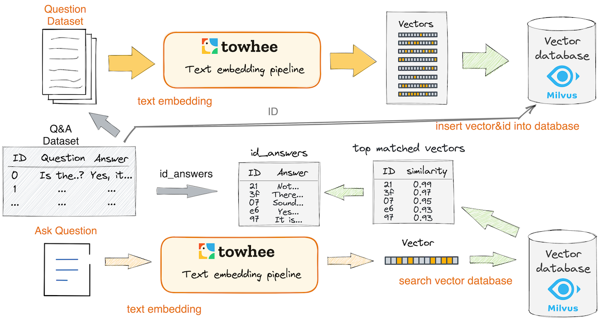

summary: Build a Qusetion Answering Engine in Minutes
id: build-a-qusetion-answering-engine-in-minutes
categories: NLP
tags: question-answering
status: Published
authors: Shiyu & Kaiyuan
Feedback Link: https://github.com/towhee-io/towhee

---

# End to End Question-Answering System

## Introduction

duration: 1

Question answering is a classic problem in the field of natural language processing. While it sounds like an easy problem to solve, there is still a lot of research going on to improve the techniques that we have now. A large part of solving questions is finding questions that are similar to the one being asked.

This example will show you how to find the similar asked question and get the answer. The basic idea behind question answering is to use Towhee to generate embedding from the question dataset and compare the input question with the embedding stored in Milvus.




## Preparations

duration: 2

### Install Dependencies

First we need to install dependencies such as pymilvus, towhee and gradio.

```bash
$ python -m pip install -q pymilvus towhee gradio
```

### Prepare the Data

There is a subset of the [InsuranceQA Corpus](https://github.com/shuzi/insuranceQA) (1000 pairs of questions and answers) used in this demo, everyone can download on [Github](https://github.com/towhee-io/examples/releases/download/data/question_answer.csv).

```bash
$ curl -L https://github.com/towhee-io/examples/releases/download/data/question_answer.csv -O
```

**question_answer.csv**: a file containing question and the answer.

Let's take a quick look:

```python
import pandas as pd

df = pd.read_csv('question_answer.csv')
df.head()
```


To use the dataset to get answers, let's first define the dictionary:

- `id_answer`: a dictionary of id and corresponding answer

```python
id_answer = df.set_index('id')['answer'].to_dict()
```

### Create Milvus Collection

Before getting started, please make sure you have [installed milvus](https://milvus.io/docs/v2.0.x/install_standalone-docker.md). Next to define the function `create_milvus_collection` to create collection in Milvus that uses the [L2 distance metric](https://milvus.io/docs/v2.0.x/metric.md#Euclidean-distance-L2) and an [IVF_FLAT index](https://milvus.io/docs/v2.0.x/index.md#IVF_FLAT).

```python
from pymilvus import connections, FieldSchema, CollectionSchema, DataType, Collection, utility

connections.connect(host='127.0.0.1', port='19530')

def create_milvus_collection(collection_name, dim):
    if utility.has_collection(collection_name):
        utility.drop_collection(collection_name)
    
    fields = [
    FieldSchema(name='id', dtype=DataType.INT64, descrition='ids', is_primary=True, auto_id=False),
    FieldSchema(name='embedding', dtype=DataType.FLOAT_VECTOR, descrition='embedding vectors', dim=dim)
    ]
    schema = CollectionSchema(fields=fields, description='reverse image search')
    collection = Collection(name=collection_name, schema=schema)

    # create IVF_FLAT index for collection.
    index_params = {
        'metric_type':'L2',
        'index_type':"IVF_FLAT",
        'params':{"nlist":2048}
    }
    collection.create_index(field_name="embedding", index_params=index_params)
    return collection
```

## Load question embedding into Milvus

duration: 2

We first generate embedding from question text with [dpr](https://towhee.io/text-embedding/dpr) operator and insert the embedding into Milvus. Towhee provides a [method-chaining style API](https://towhee.readthedocs.io/en/main/index.html) so that users can assemble a data processing pipeline with operators.

```bash
import towhee

collection = create_milvus_collection('question_answer', 768)

dc = (
    towhee.read_csv('question_answer.csv')
      .runas_op['id', 'id'](func=lambda x: int(x))
      .text_embedding.dpr['question', 'vec'](model_name="facebook/dpr-ctx_encoder-single-nq-base")
      .runas_op['vec', 'vec'](func=lambda x: x.squeeze(0))
      .tensor_normalize['vec', 'vec']()
      .to_milvus['id', 'vec'](collection=collection, batch=100)
)

print('Total number of inserted data is {}.'.format(collection.num_entities))
```

#### Explanation of Data Processing Pipeline

Here is detailed explanation for each line of the code:

`towhee.read_csv('question_answer.csv')`: read tabular data from the file (id, question and answer columns);

`.runas_op['id', 'id'](func=lambda x: int(x))`: for each row from the data, convert the data type of the column id from `str` to `int`;

`.text_embedding.dpr['question', 'vec'](model_name="facebook/dpr-ctx_encoder-single-nq-base")`: use the `acebook/dpr-ctx_encoder-single-nq-base` model to generate the question embedding vector with the [dpr operator](https://towhee.io/text-embedding/dpr) in towhee hub;

`.runas_op['vec', 'vec'](func=lambda x: x.squeeze(0))`: the vec shape after dpr operator is (1, 768), so we need to squeeze it;

`.tensor_normalize['vec', 'vec']()`: normalize the embedding vector;

`.to_milvus['id', 'vec'](collection=collection, batch=100)`: insert question embedding vector into Milvus;

## Ask Question with Milvus and Towhee

duration: 2

Now that embedding for question dataset have been inserted into Milvus, we can ask question with Milvus and Towhee. Again, we use Towhee to load the input question, compute a embedding, and use it as a query in Milvus. Because Milvus only outputs IDs and distance values, we provide the `id_answers` dictionary to get the answers based on IDs and display.

```
dc = ( towhee.dc(['Is  Disability  Insurance  Required  By  Law?'])
      .text_embedding.dpr(model_name="facebook/dpr-ctx_encoder-single-nq-base")
      .runas_op(func=lambda x: x.squeeze(0))
      .tensor_normalize()
      .milvus_search(collection='question_answer', limit=1)
      .runas_op(func=lambda res: [id_answer[x.id] for x in res])
      .to_list()
)
```

Then we can get the answer about 'Is Disability Insurance Required By Law?'.

```
dc[0]
```

'Not generally. There are five states that require most all employers carry short term disability insurance on their employees. These states are: California, Hawaii, New Jersey, New York, and Rhode Island. Besides this mandatory short term disability law, there is no other legislative imperative for someone to purchase or be covered by disability insurance.'

## Release a Showcase

duration: 2

We've done an excellent job on the core functionality of our question answering engine. Now it's time to build a showcase with interface. [Gradio](https://gradio.app/) is a great tool for building demos. With Gradio, we simply need to wrap the data processing pipeline via a `chat` function:

```python
def chat(message, history):
    history = history or []
    with towhee.api() as api:
           qa_function = (
                api.text_embedding.dpr(model_name="facebook/dpr-ctx_encoder-single-nq-base")
                    .runas_op(func=lambda x: x.squeeze(0))
                    .tensor_normalize()
                    .milvus_search(collection='question_answer', limit=3)
                    .runas_op(func=lambda res: [id_answer[x.id]+'\n' for x in res])
                    .as_function()
            )
    response = qa_function(message)[0]
    history.append((message, response))
    return history, history
    
import gradio

chatbot = gradio.Chatbot(color_map=("green", "gray"))
interface = gradio.Interface(
    chat,
    ["text", "state"],
    [chatbot, "state"],
    allow_screenshot=False,
    allow_flagging="never",
)
interface.launch(inline=True, share=True)
```
