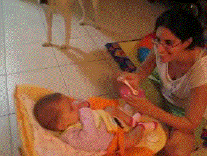

summary: Build a Reverse Video Search Engine in minutes
id: build-a-reverse-video-search-engine-in-minutes
categories: Video
tags: reverse-video-search
status: Published
authors: Mengjia
Feedback Link: https://github.com/towhee-io/towhee

---

# Build a Reverse Video Search Engine in minutes

## Introduction

This codelab will show how to build a reverse-video-search engine from scratch using [Milvus](https://milvus.io/) and [Towhee](https://towhee.io/). We will go through the procedure of building a reverse-video-search engine and evaluate its performance.

**What is Reverse Video Search?**

Reverse video search is similar like [reverse image search](https://en.wikipedia.org/wiki/Reverse_image_search). In simple words, it takes a video as input to search for similar videos. As we know that video-related tasks are harder to tackle, video models normally do not achieve as high scores as other types of models. However, there are increasing demands in AI applications in video. Reverse video search can effectively discover related videos and improve other applications.


**What are Milvus & Towhee?**

- Milvus is the most advanced open-source vector database built for AI applications and supports nearest neighbor embedding search across tens of millions of entries.
- Towhee is a framework that provides ETL for unstructured data using SoTA machine learning models.

## Preparation

### Install packages

Make sure you have installed required python packages(pymilvus, towhee, towhee.models, pillow, python, gradio):

```bash
$ python -m pip install -q pymilvus towhee towhee.models pillow ipython gradio
```

### Prepare data

This tutorial will use a small data extracted from [Kinetics400](https://www.deepmind.com/open-source/kinetics). You can download the subset from [Github](https://github.com/towhee-io/examples/releases/download/data/reverse_video_search.zip).

The data is organized as follows:

- **train:** candidate videos, 20 classes, 10 videos per class (200 in total)
- **test:** query videos, same 20 classes as train data, 1 video per class (20 in total)
- **reverse_video_search.csv:** a csv file containing an ***id\***, ***path\***, and ***label\*** for each video in train data

First to download the data and unzip it:

```bash
$ curl -L https://github.com/towhee-io/examples/releases/download/data/reverse_video_search.zip -O
$ unzip -q -o reverse_video_search.zip
```

Let's take a quick look:

```python
import pandas as pd

df = pd.read_csv('./reverse_video_search.csv')
df.head(3)
```


For later steps to easier get videos & measure results, we build some helpful functions in advance:

- **ground_truth:** get ground-truth video ids for the query video by its path

```python
id_video = df.set_index('id')['path'].to_dict()
label_ids = {}
for label in set(df['label']):
    label_ids[label] = list(df[df['label']==label].id)
    

def ground_truth(path):
    label = path.split('/')[-2]
    return label_ids[label]
```

### Start Milvus

Before getting started with the engine, we also need to get ready with Milvus. Please make sure that you have started a Milvus service ([Milvus Guide](https://milvus.io/docs/v2.0.x/install_standalone-docker.md)). Here we prepare a function to work with a Milvus collection with the following parameters:

- [L2 distance metric](https://milvus.io/docs/v2.0.x/metric.md#Euclidean-distance-L2)
- [IVF_FLAT index](https://milvus.io/docs/v2.0.x/index.md#IVF_FLAT).

```python
from pymilvus import connections, FieldSchema, CollectionSchema, DataType, Collection, utility

connections.connect(host='localhost', port='19530')

def create_milvus_collection(collection_name, dim):
    if utility.has_collection(collection_name):
        utility.drop_collection(collection_name)
    
    fields = [
    FieldSchema(name='id', dtype=DataType.INT64, descrition='ids', is_primary=True, auto_id=False),
    FieldSchema(name='embedding', dtype=DataType.FLOAT_VECTOR, descrition='embedding vectors', dim=dim)
    ]
    schema = CollectionSchema(fields=fields, description='reverse video search')
    collection = Collection(name=collection_name, schema=schema)

    # create IVF_FLAT index for collection.
    index_params = {
        'metric_type':'L2',
        'index_type':"IVF_FLAT",
        'params':{"nlist": 400}
    }
    collection.create_index(field_name="embedding", index_params=index_params)
    return collection
```

## Load Video Embeddings into Milvus

We first generate embeddings for videos with [X3D model](https://arxiv.org/abs/2004.04730) and then insert video embeddings into Milvus. Towhee provides a [method-chaining style API](https://towhee.readthedocs.io/en/main/index.html) so that users can assemble a data processing pipeline with operators.

```python
import towhee

collection = create_milvus_collection('x3d_m', 2048)

dc = (
    towhee.read_csv('reverse_video_search.csv')
      .runas_op['id', 'id'](func=lambda x: int(x))
      .video_decode.ffmpeg['path', 'frames'](sample_type='uniform_temporal_subsample', args={'num_samples': 16})
      .video_classification['frames', ('labels', 'scores', 'features')].pytorchvideo(
          model_name='x3d_m', skip_preprocess=True)
      .to_milvus['id', 'features'](collection=collection, batch=10)
)
```

**Pipeline Explanation**

Here are some details for each line of the assemble pipeline:

- `towhee.read_csv()`: read tabular data from csv file
- `.runas_op['id', 'id'](func=lambda x: int(x))`: for each row from the data, convert data type of the column id to int
- `.video_decode.ffmpeg['path', 'frames']()`: an embeded Towhee operator reading video as frames with specified sample method and number of samples. [learn more](https://towhee.io/video-decode/ffmpeg)
- `.video_classification['frames', ('labels', 'scores', 'features')].pytorchvideo()`: an embeded Towhee operator applying specified model to video frames, which can be used to generate video embedding. [learn more](https://towhee.io/video-classification/pytorchvideo)
- `.to_milvus['id', 'features']()`: insert video embedding into Milvus collection

## Query Similar Videos from Milvus

Now all embeddings of candidate videos have been inserted into Milvus collection, we can query embeddings across the collection for nearest neighbors.

To get query embeddings, we should go through same pre-insert steps for each input video. Because Milvus returns video ids and vector distances, we use the `id_video` dictionary to get corresponding video paths based on ids.

```python
collection = Collection('x3d_m')

query_path = './test/eating_carrots/ty4UQlowp0c.mp4'

res_paths = (
    towhee.glob['path'](query_path)
        .video_decode.ffmpeg['path', 'frames'](sample_type='uniform_temporal_subsample', args={'num_samples': 16})
        .video_classification['frames', ('labels', 'scores', 'features')].pytorchvideo(
          model_name='x3d_m', skip_preprocess=True)
        .milvus_search['features', 'result'](collection=collection, limit=10)
        .runas_op['result', 'res_path'](func=lambda res: [id_video[x.id] for x in res])
        .select['res_path']().to_list()[0].res_path
)
```

To display in the notebook, we convert videos to gifs. The code below first loads each video from its path and then gets full video frames with the embeded Towhee operator `.video_decode.ffmpeg()`. Finally converted gifs are saved under the directory *tmp_dir*. The section below is just help to show a search example.

```python
import os
from IPython import display
from PIL import Image

tmp_dir = './tmp'
os.makedirs(tmp_dir, exist_ok=True)

def video_to_gif(video_path):
    gif_path = os.path.join(tmp_dir, video_path.split('/')[-1][:-4] + '.gif')
    frames = (
        towhee.glob(video_path)
              .video_decode.ffmpeg(sample_type='uniform_temporal_subsample', args={'num_samples': 16})
              .to_list()[0]
    )
    imgs = [Image.fromarray(frame) for frame in frames]
    imgs[0].save(fp=gif_path, format='GIF', append_images=imgs[1:], save_all=True, loop=0)
    return gif_path

html = 'Query video "{}": <br/>'.format(query_path.split('/')[-2])
query_gif = video_to_gif(query_path)
html_line = ' <br/>'.format(query_gif)
html +=  html_line
html += 'Top 3 search results: <br/>'

for path in res_paths[:3]:
    gif_path = video_to_gif(path)
    html_line = ''.format(gif_path)
    html +=  html_line
display.HTML(html)
```

Query video "eating_carrots":


Top 3 search results:




## Evaluation

We have just built a reverse video search engine. But how's its performance? We can evaluate the search engine against the ground truths.

In this section, we'll measure the performance with 2 metrics - mHR and mAP:

- **mHR (recall@K):**
  - Mean Hit Ratio describes how many actual relevant results are returned out of all ground truths.
  - Since Milvus return results with topK, we can also call this metric *recall@K*, where K is the count of searched results. When returned results are as many as ground truths, the hit ratio is equivalent to accuracy and we can take it as *accuracy@K* as well.
  - For example, there are 100 archery videos in the collection. Then querying the engine with another archery video returns 70 archery videos out of 80 results. In this case, the number of ground truths is 100 and hitted (correct) results are 70. So the hit ratio is 70/100.
- **mAP:**
  - Average precision describes whether all of the relevant results are ranked higher than irrelevant results.

```python
benchmark = (
    towhee.glob['path']('./test/*/*.mp4')
        .video_decode.ffmpeg['path', 'frames'](sample_type='uniform_temporal_subsample', args={'num_samples': 16})
        .video_classification['frames', ('labels', 'scores', 'features')].pytorchvideo(
            model_name='x3d_m', skip_preprocess=True)
        .milvus_search['features', 'result'](collection=collection, limit=10)
        .runas_op['path', 'ground_truth'](func=ground_truth)
        .runas_op['result', 'result'](func=lambda res: [x.id for x in res])
        .with_metrics(['mean_hit_ratio', 'mean_average_precision'])
        .evaluate['ground_truth', 'result']('x3d_m')
        .report()
)
```


## Optimization

We can see from above evaluation report, the current performance is not satisfactory. What can we do to improve the search engine? Of course we can fine-tune deep learning network with our own train data. Using more types of embeddings or filters by video tags/description/captions and audio can definitely enhance the search engine as well. But in this tutorial, I will just recommend some very simple options to make improvements.

### Normalize embeddings

A quick optimization is normalizing all embeddings. Then the L2 distance will be equivalent to cosine similarity, which measures the similarity between two vectors using the angle between them, which ignores the magnitude of the vectors. We use the `.tensor_normalize['vec', 'vec']()` provided by Towhee to simply normalize all embeddings.

```python
collection = create_milvus_collection('x3d_m', 2048)

dc = (
    towhee.read_csv('reverse_video_search.csv')
      .runas_op['id', 'id'](func=lambda x: int(x))
      .video_decode.ffmpeg['path', 'frames'](sample_type='uniform_temporal_subsample', args={'num_samples': 16})
      .video_classification['frames', ('labels', 'scores', 'features')].pytorchvideo(
          model_name='x3d_m', skip_preprocess=True)
      .tensor_normalize['features', 'features']()
      .to_milvus['id', 'features'](collection=collection, batch=10)
)

benchmark = (
    towhee.glob['path']('./test/*/*.mp4')
        .video_decode.ffmpeg['path', 'frames'](sample_type='uniform_temporal_subsample', args={'num_samples': 16})
        .video_classification['frames', ('labels', 'scores', 'features')].pytorchvideo(
            model_name='x3d_m', skip_preprocess=True)
        .tensor_normalize['features', 'features']()
        .milvus_search['features', 'result'](collection=collection, limit=10)
        .runas_op['path', 'ground_truth'](func=ground_truth)
        .runas_op['result', 'result'](func=lambda res: [x.id for x in res])
        .with_metrics(['mean_hit_ratio', 'mean_average_precision'])
        .evaluate['ground_truth', 'result']('x3d_m_norm')
        .report()
)
```


With vector normalization, we have increased the mHR to 0.66 and mAP to about 0.8, which look better now.

### Change model

There are more video models using different networks. Normally a more complicated or larger model will show better results while cost more. You can always try more models to tradeoff among accuracy, latency, and resource usage. Here I show the performance for the reverse video search engine using a SOTA model with [multiscale vision transformer](https://arxiv.org/abs/2104.11227) as backbone.

```python
collection = create_milvus_collection('mvit_base', 768)

dc = (
    towhee.read_csv('reverse_video_search.csv')
      .runas_op['id', 'id'](func=lambda x: int(x))
      .video_decode.ffmpeg['path', 'frames'](sample_type='uniform_temporal_subsample', args={'num_samples': 32})
      .video_classification['frames', ('labels', 'scores', 'features')].pytorchvideo(
          model_name='mvit_base_32x3', skip_preprocess=True)
      .tensor_normalize['features', 'features']()
      .to_milvus['id', 'features'](collection=collection, batch=10)
)

benchmark = (
    towhee.glob['path']('./test/*/*.mp4')
        .video_decode.ffmpeg['path', 'frames'](sample_type='uniform_temporal_subsample', args={'num_samples': 32})
        .video_classification['frames', ('labels', 'scores', 'features')].pytorchvideo(
          model_name='mvit_base_32x3', skip_preprocess=True)
      .tensor_normalize['features', 'features']()
        .milvus_search['features', 'result'](collection=collection, limit=10)
        .runas_op['path', 'ground_truth'](func=ground_truth)
        .runas_op['result', 'result'](func=lambda res: [x.id for x in res])
        .with_metrics(['mean_hit_ratio', 'mean_average_precision'])
        .evaluate['ground_truth', 'result']('mvit_base')
        .report()
)
```


Switching to MVIT model increases the mHR to 0.79 and mAP to 0.86, which are much better than X3D model. However, both insert and search time have increased. It's time for you to make trade-off between latency and accuracy. You're always encouraged to play around with this tutorial.

## Release a Showcase

We've learnt how to build a reverse video search engine. Now it's time to add some interface and release a showcase. Towhee provides `towhee.api()` to wrap the data processing pipeline as a function with `.as_function()`. So we can build a quick demo with this `milvus_search_function` with [Gradio](https://gradio.app/).

```python
import gradio

with towhee.api() as api:
    milvus_search_function = (
         api.video_decode.ffmpeg(
                sample_type='uniform_temporal_subsample', args={'num_samples': 32})
            .video_classification.pytorchvideo(model_name='mvit_base_32x3', skip_preprocess=True)
            .runas_op(func=lambda x: x[-1])
            .tensor_normalize()
            .milvus_search(collection='mvit_base', limit=3)
            .runas_op(func=lambda res: [id_video[x.id] for x in res])
            .as_function()
    )
    

interface = gradio.Interface(milvus_search_function, 
                             inputs=gradio.Video(source='upload'),
                             outputs=[gradio.Video(format='mp4') for _ in range(5)]
                            )

interface.launch(inline=True, share=True)
```
