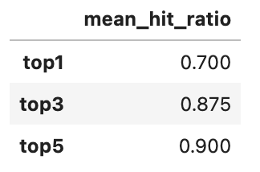
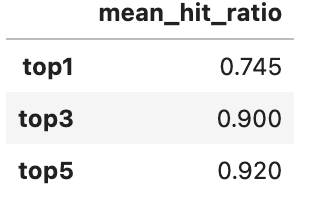
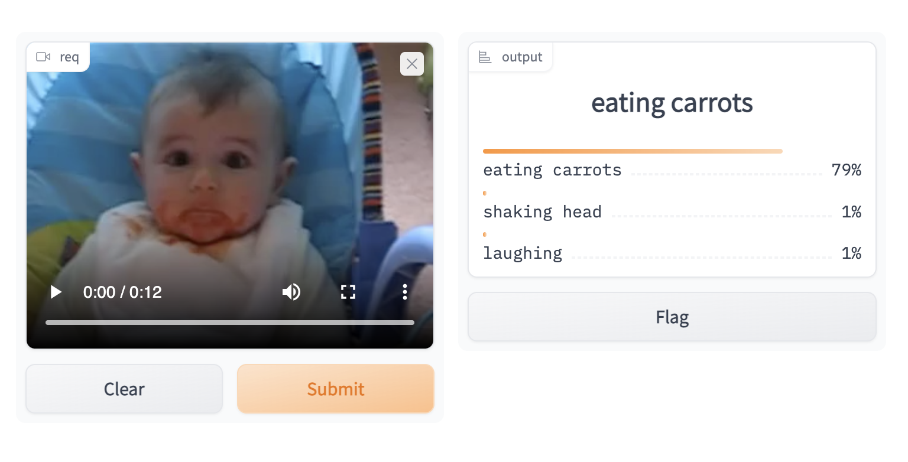

summary: Build a Video Classification System in 5 Lines
id: build-a-video-classification-system-in-5-lines
categories: Video
tags: video-tagging
status: Published
authors: Mengjia
Feedback Link: https://github.com/towhee-io/towhee

---

# Build a Video Classification System in 5 Lines

## Introduction

duration: 0.5

Video tagging means adding proper tags for videos. Tags can be various from different aspects. For example, object detection, action recognition, place identification can all contribute to video tagging.

This codelab will show you how to build a basic video classification system with sample data (of 20 human activities), visualize predicted labels, and measure the system with performance metrics. Moreover, you can try optimization methods for accuracy and efficiency. At the end, you are able to build up a playable video classification system with 5 lines of code.

## Preparation

duration: 1

### Install Dependencies

First make sure you have installed required python packages:

```bash
$ python -m pip install -q pymilvus towhee towhee.models pillow ipython gradio
```

### Prepare the data

This tutorial will use a small data extracted from validation data of [Kinetics400](https://www.deepmind.com/open-source/kinetics). You can download the subset from [Github](https://github.com/towhee-io/data/releases/download/video-data/reverse_video_search.zip). This tutorial will just use 200 videos under `train` as example.

The data is organized as follows:

- **train:** 20 classes, 10 videos per class (200 in total)
- **reverse_video_search.csv:** a csv file containing an ***id\***, ***path\***, and ***label\*** for each video in train directory

First to download the dataset and unzip it:

```bash
$ curl -L https://github.com/towhee-io/data/releases/download/video-data/reverse_video_search.zip -O
$ unzip -q -o reverse_video_search.zip
```

Let's take a quick look:

```python
import pandas as pd

df = pd.read_csv('./reverse_video_search.csv')
print(df.head(3))
print(df.label.value_counts())
```


For later steps to easier get videos & measure results, we build some helpful functions in advance:

- **ground_truth:** get ground-truth label for the video by its path

```python
def ground_truth(path):
    label = df.set_index('path').at[path, 'label']
    return [label.replace('_', ' ')]import cv2
from towhee._types.image import Image

id_img = df.set_index('id')['path'].to_dict()
def read_images(results):
    imgs = []
    for re in results:
        path = id_img[re.id]
        imgs.append(Image(cv2.imread(path), 'BGR'))
    return imgs
```

## Predict labels

duration: 2

Let's take some 'tap_dancing' videos as example to see how to predict labels for videos within 5 lines. By default, the system will predict top 5 labels sorting by scores (of possibility) from high to low. You can control the number of labels returnbed by change `topk`. Please note that the first time run will take some time to download model.

```python
import towhee

(
    towhee.glob['path']('./train/tap_dancing/*.mp4')
          .video_decode.ffmpeg['path', 'frames'](sample_type='uniform_temporal_subsample', args={'num_samples': 16})
          .action_classification['frames', ('predicts', 'scores', 'features')].pytorchvideo(
              model_name='x3d_m', skip_preprocess=True, topk=5)
          .select['path', 'predicts', 'scores']()
          .show()
)
```


Here are some details for each line of the assemble pipeline:

- `towhee.read_csv()`: read tabular data from csv file

- `.video_decode.ffmpeg()`: an embeded Towhee operator reading video as frames with specified sample method and number of samples. [learn more](https://towhee.io/video-decode/ffmpeg)
- `.action_classification.pytorchvideo()`: an embeded Towhee operator applying specified model to video frames, which can be used to predict labels and extract features for video. [learn more](https://towhee.io/action-classification/pytorchvideo)

## Evaluation

duration: 1

We have just showed how to classify video, but how's its performance? Towhee has provided different options for metrics to evaluate predicted results against ground truths.

In this section, we'll measure the performance with the average metric value:

- mHR (recall@K):
  - Mean Hit Ratio describes how many actual relevant results are returned out of all ground truths.
  - Since we predict top K labels while only 1 ground truth for each entity, the mean hit ratio is equivalent to recall@topk.

```python
import time

start = time.time()
dc = (
    towhee.read_csv('reverse_video_search.csv').unstream()
          .video_decode.ffmpeg['path', 'frames'](sample_type='uniform_temporal_subsample', args={'num_samples': 16})
          .action_classification['frames', ('predicts', 'scores', 'features')].pytorchvideo(
              model_name='x3d_m', skip_preprocess=True, topk=5)
)
end = time.time()
print(f'Total time: {end-start}')

benchmark = (
    dc.runas_op['path', 'ground_truth'](func=ground_truth)
      .runas_op['predicts', 'top1'](func=lambda x: x[:1])
      .runas_op['predicts', 'top3'](func=lambda x: x[:3])
      .with_metrics(['mean_hit_ratio'])
      .evaluate['ground_truth', 'top1'](name='top1')
      .evaluate['ground_truth', 'top3'](name='top3')
      .evaluate['ground_truth', 'predicts'](name='top5')
      .report()
)
```



## Optimization

duration: 2

You're always encouraged to play around with the tutorial. We present some optimization options here to make improvements in accuracy, latency, and resource usage. With these methods, you can make the classification system better in performance and more feasible in production.

### Change model

There are more video models using different networks. Normally a more complicated or larger model will show better results while cost more. You can always try more models to tradeoff among accuracy, latency, and resource usage. Here I show the performance of video classification using a SOTA model with [multiscale vision transformer](https://arxiv.org/abs/2104.11227) as backbone.

```python
benchmark = (
    towhee.read_csv('reverse_video_search.csv').unstream()
          .video_decode.ffmpeg['path', 'frames'](sample_type='uniform_temporal_subsample', args={'num_samples': 32})
          .action_classification['frames', ('predicts', 'scores', 'features')].pytorchvideo(
              model_name='mvit_base_32x3', skip_preprocess=True, topk=5)
          .runas_op['path', 'ground_truth'](func=ground_truth)
          .runas_op['predicts', 'top1'](func=lambda x: x[:1])
          .runas_op['predicts', 'top3'](func=lambda x: x[:3])
          .with_metrics(['mean_hit_ratio'])
          .evaluate['ground_truth', 'top1'](name='top1')
          .evaluate['ground_truth', 'top3'](name='top3')
          .evaluate['ground_truth', 'predicts'](name='top5')
          .report()
)
```



## Deploy with parallel and exception safe

duration: 2

### Parallel Execution

We are able to enable parallel execution by simply calling set_parallel within the pipeline. It tells Towhee to process the data in parallel. The code below enables parallel execution on the above example. It shows that it finishes the classification of 200 videos within 2 seconds with 5 parallel executions.

```python
dc = (
    towhee.read_csv('reverse_video_search.csv')
          .set_parallel(5)
          .video_decode.ffmpeg['path', 'frames'](sample_type='uniform_temporal_subsample', args={'num_samples': 16})
          .action_classification['frames', ('predicts', 'scores', 'features')].pytorchvideo(
              model_name='x3d_m', skip_preprocess=True, topk=5)
)
```

### Exception Safe

When we have large-scale data, there may be some bad data that will cause errors. Typically, the users don't want such errors to break the system in production. Therefore, the pipeline should continue to process the rest of the videos and report broken ones.

Towhee supports an `exception-safe` execution mode that allows the pipeline to continue on exceptions and represent the exceptions with Empty values. The user can choose how to deal with the empty values at the end of the pipeline. During the query below, there are 4 files in total under the exception folder, one of them is broken. With `exception-safe`, it will print the ERROR but NOT terminate the process. As you can see from results, `drop_empty` deletes empty data.

```python
(
    towhee.glob['path']('./exception/*')
          .exception_safe()
          .video_decode.ffmpeg['path', 'frames'](sample_type='uniform_temporal_subsample', args={'num_samples': 16})
          .action_classification['frames', ('labels', 'scores', 'vec')].pytorchvideo(
              model_name='x3d_m', skip_preprocess=True)
          .drop_empty()
          .select['path', 'labels']()
          .show()
)
```


## Release a Showcase

duration: 2

We've learnt how to build a reverse video search engine. Now it's time to add some interface and release a showcase. Towhee provides `towhee.api()` to wrap the data processing pipeline as a function with `.as_function()`. So we can build a quick demo with this `action_classification_function` with [Gradio](https://gradio.app/).

```python
import gradio

topk = 3
with towhee.api() as api:
    action_classification_function = (
         api.video_decode.ffmpeg(
                sample_type='uniform_temporal_subsample', args={'num_samples': 32})
            .action_classification.pytorchvideo(model_name='mvit_base_32x3', skip_preprocess=True, topk=topk)
            .runas_op(func=lambda res: {res[0][i]: res[1][i] for i in range(len(res[0]))})
            .as_function()
    )
    

interface = gradio.Interface(action_classification_function, 
                             inputs=gradio.Video(source='upload'),
                             outputs=[gradio.Label(num_top_classes=topk)]
                            )


interface.launch(inline=True, share=True)
```


